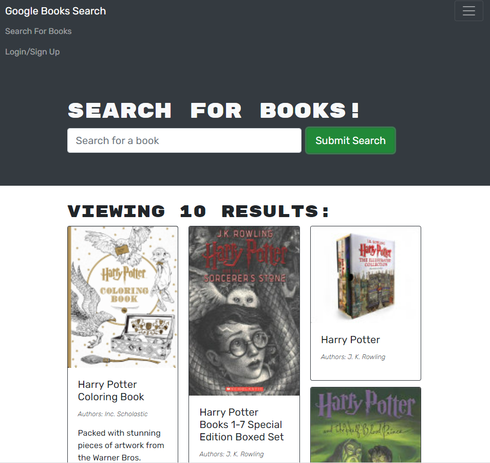

# Book Search

# Description
In this project take a fully functioning Google Books API search engine built with a RESTful API, and refactor it to be a GraphQL API built with Apollo Server. The app was built using the MERN stack, with a React front end, MongoDB database, and Node.js/Express.js server and API.

## User Story
AS AN avid reader
I WANT to search for new books to read
SO THAT I can keep a list of books to purchase

## Table of Contents 

* [Usage](#usage)
* [License](#license)
* [Technologies](#Technologies)
* [Screenshots](#Screenshots)
* [Questions](#questions)

## Usage 

View the App
[here](https://serene-shore-16171.herokuapp.com/)

## License

This Application is covered under : 

[mit](https://choosealicense.com/licenses/mit)
 

## Technologies
* MongoDB
* Express
* React
* Nodejs

## Screenshots

## Questions
View my Github Profile at [CynthiaMohan](http://github.com/CynthiaMohan)
 
Reach me with more questions <cynthiamohan1@gmail.com>

